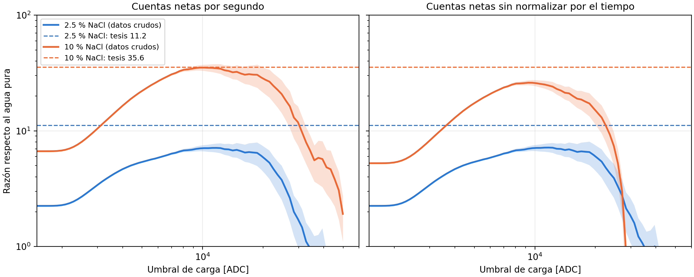

# Razones de mejora de la señal reconstruidas desde los datos crudos

Intento de reproducir la Tabla `tab:signal_comparison` de la Sección 4.1.2 (experimento: 11.2 ± 0.1
para 2.5 % de NaCl y 35.6 ± 0.2 para 10 %, relativas al agua pura) partiendo de los seis archivos de
datos crudos LAGO v5.

## Reproducción

```bash
for f in pura_neutrones pura_fondo 2.5_neutrones 2.5_fondo 10_neutrones 10_fondo; do
  ./extraer_eventos.sh <carpeta-datos>/$f.dat <trabajo>/ev_$f.tsv <trabajo>/res_$f.tsv &
done; wait                                  # ~2 min; los ev_*.tsv (4.6 M pulsos) no se versionan
python3 calcular_razones.py <trabajo>       # razones.tsv, razones_umbral.tsv, tiempos_adquisicion.tsv, figura
```

`extraer_eventos.sh` calcula por pulso tres cargas: la de los histogramas `*_charge_hist.csv`
(`carga_ventana`), la de las figuras de la tesis (`carga_figura`) y una variante con línea base
anterior al pulso (`carga_pretrig`). **Verificación:** con `carga_figura`, la diferencia
fuente − fondo reproduce bin a bin los archivos `diferencia_original_*_bins9425.dat` que produjo el
notebook para la figura `Comparacion-3-configuraciones-bins9425` (0 bins distintos en agua pura; un
bin de una cuenta en 2.5 % y 10 %, por el último pulso truncado de cada archivo de fondo, que el
notebook cuenta y aquí se descarta).

## Tiempos de adquisición

Contrariamente a lo que se creía, están en los datos: el equipo escribe una marca `# x h` por segundo.

| Medio | Fuente + fondo | Fondo |
|---|---|---|
| agua pura | 563 961 pulsos en 300 s (1880 Hz) | 125 401 en 300 s (418 Hz) |
| 2.5 % NaCl | 1 099 688 en 300 s (3666 Hz) | 114 226 en 299 s (382 Hz) |
| 10 % NaCl | 2 488 416 en **240 s** (10 368 Hz) | 185 750 en 299 s (621 Hz) |

La toma de 10 % con fuente dura 240 s y no 300 s, por lo que las comparaciones sin normalizar por el
tiempo (como la figura del exceso de cuentas) subestiman la señal de 10 % en un 20 %.

## Resultados

| Definición de señal neta | 2.5 % | 10 % |
|---|---|---|
| Cuentas netas por segundo (todos los disparos) | 2.246 ± 0.005 | 6.67 ± 0.01 |
| Cuentas netas sin normalizar por el tiempo | 2.247 ± 0.005 | 5.25 ± 0.01 |
| Carga neta por segundo | 2.99 ± 0.02 | 10.11 ± 0.07 |
| Carga neta sin normalizar | 2.99 ± 0.02 | 7.79 ± 0.06 |
| Cuentas netas por segundo con Q ≥ umbral (máximo sobre el umbral) | **7.1 ± 0.6** (≈ 1.2·10⁴ ADC) | 35.2 ± 2.2 (≈ 1.0·10⁴ ADC) |
| **Tesis** | **11.2 ± 0.1** | **35.6 ± 0.2** |



## Conclusión

- **Ninguna definición razonable reproduce las dos razones a la vez.** El valor de 10 % (35.6) se
  alcanza con un umbral de carga de ≈ 10⁴ ADC y normalización por tiempo; con ese mismo umbral la
  razón de 2.5 % es 7.1 ± 0.6, y ningún umbral la lleva por encima de ≈ 7.2 con ninguna de las tres
  definiciones de carga.
- Las incertidumbres de la tesis (±0.1 y ±0.2, ≲ 1 %) solo son compatibles con razones calculadas
  sobre casi todos los pulsos. Con un umbral de 10⁴ ADC el exceso del agua pura es de unos pocos
  miles de cuentas y la incertidumbre de Poisson de la razón es del 6–9 %.
- Las razones sobre el total de pulsos (2.25 y 6.67) y de carga (3.0 y 10.1) son las que se obtienen
  de forma directa y con incertidumbre pequeña; cualquiera de ellas cambia la comparación con la
  simulación (13.2 y 31.8).

**Pendiente (autor):** identificar el origen de 11.2 y 35.6 (cálculo del grupo de Bariloche, otra toma
de datos u otra definición). Si no se encuentra, la Tabla `tab:signal_comparison` debe recalcularse con
una definición explícita, aplicando la misma a la simulación.
