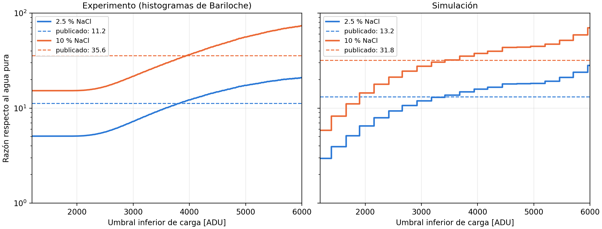

# Razones de mejora de la señal (Tabla `tab:signal_comparison`)

La Tabla `tab:signal_comparison` de la Sección 4.1.2 (experimento: 11.2 ± 0.1 para 2.5 % de NaCl y
35.6 ± 0.2 para 10 %; simulación: 13.2 y 31.8; MAE 2.87 ± 0.07; errores relativos 17.6 % y 10.6 %)
reproduce los valores publicados en:

> C. Sarmiento-Cano, J. Betancourt, A. Núñez Selin, L. Miranda-Leuro, I. Sidelnik, H. Asorey y
> L. A. Núñez, *Water Cherenkov Detectors in Precision Agriculture: A Novel Approach for
> High-Resolution Soil Moisture Monitoring*, arXiv:2601.17595 (2026).

El análisis de los datos del prototipo lo hizo el grupo del Centro Atómico Bariloche; el autor de esta
tesis suministró los espectros simulados. La publicación describe el método solo como resta bin a bin
del fondo en tomas de 5 minutos. Esta carpeta documenta la trazabilidad de esas cifras en dos partes:
(1) el procedimiento de Bariloche, reconstruido desde sus histogramas, y (2) un cálculo independiente
desde los datos crudos.

## 1. Procedimiento de Bariloche

Los histogramas `../datos-derivados/histogramas-carga/*_charge_hist.csv` son, byte a byte, la salida
del programa de procesamiento del grupo de Bariloche (`process.py`, copia de trabajo en el disco del
autor, `Detector-prototipo-PC/process/`, SHA-256 `db3ac9fddd152985f11bd82ab67ec8db907403ba09a0b5f7aa291e3fced00892`).
Ese programa no se incluye en el repositorio porque es trabajo inédito de otro grupo; su contenido
relevante es:

| Paso | `process.py` |
|---|---|
| Carga por pulso | suma de la parte positiva contigua a la muestra 8; se descartan los pulsos con pico ≤ 1200 ADU |
| Histogramas | bins de 20 ADU desde 1200 ADU |
| Espectro neto | neutrones − fondo, bin a bin, **sin normalizar por el tiempo** |
| Agua pura | eje de carga **dividido por 1.4** («corrección tanque con agua pura») y exceso **anulado por encima de 13 000 ADU** («truncar cola ruidosa») |
| Simulación | fotones → carga con 1000/3.95 ADU por fotón; curvas multiplicadas por 10 para la figura |

`process.py` genera la figura `spectra_comparison.png`, pero no calcula razones. La copia de la
simulación usada por Bariloche, además, tiene reducidas a mano las cuentas del agua pura desde 20.5
fotones (≈ 5200 ADU); por debajo coincide con `../datos-derivados/simulacion/counts-number-photons.txt`.

`razones_histogramas_bariloche.py` aplica ese tratamiento y barre el umbral inferior de carga U, ya
que la publicación no lo indica:

```bash
python3 razones_histogramas_bariloche.py      # razones_bariloche_umbral.tsv, fig_razones_bariloche.{pdf,png}
```

| Umbral U | 2.5 % | 10 % |
|---|---|---|
| Experimento, 3820 ADU | **11.20 ± 0.08** | 33.31 ± 0.23 |
| Experimento, 3940 ADU | 11.93 ± 0.09 | **35.63 ± 0.27** |
| Publicado (experimento) | 11.2 ± 0.1 | 35.6 ± 0.2 |
| Simulación, 3180 ADU (≈ 12.5 fotones) | 13.0 | 32.8 |
| Simulación, 3420 ADU (≈ 13.5 fotones) | 16.1 | 32.2 |
| Publicado (simulación) | 13.2 | 31.8 |



**Conclusión.** Las cifras publicadas proceden de este tratamiento con un umbral inferior de carga
de ≈ 3.8–3.9·10³ ADU en el experimento y de ≈ 12–13 fotones (≈ 3.2·10³ ADU) en la simulación: se
reproducen por separado y con incertidumbres de Poisson del mismo tamaño que las publicadas, pero
ningún umbral único da los dos valores experimentales a la vez (el mejor, U = 3920 ADU, da 11.7 y
35.0), y el experimento y la simulación no se comparan con el mismo umbral. Además, las razones
dependen de la corrección de 1.4 aplicada solo al agua pura: sin ella, con cualquier umbral, la razón
de 2.5 % no pasa de ≈ 7. El detalle exacto debe confirmarse con el grupo de Bariloche.

## 2. Cálculo independiente desde los datos crudos

### Reproducción

```bash
for f in pura_neutrones pura_fondo 2.5_neutrones 2.5_fondo 10_neutrones 10_fondo; do
  ./extraer_eventos.sh <carpeta-datos>/$f.dat <trabajo>/ev_$f.tsv <trabajo>/res_$f.tsv &
done; wait                                  # ~2 min; los ev_*.tsv (4.6 M pulsos) no se versionan
python3 calcular_razones.py <trabajo>       # razones.tsv, razones_umbral.tsv, tiempos_adquisicion.tsv, figura
```

`extraer_eventos.sh` calcula por pulso tres cargas: la de los histogramas `*_charge_hist.csv`
(`carga_ventana`), la de las figuras de la tesis (`carga_figura`) y una variante con línea base
anterior al pulso (`carga_pretrig`). **Verificación:** con `carga_figura`, la diferencia
fuente − fondo reproduce bin a bin los archivos `diferencia_original_*_bins9425.dat` que produjo el
notebook para la figura `Comparacion-3-configuraciones-bins9425` (0 bins distintos en agua pura; un
bin de una cuenta en 2.5 % y 10 %, por el último pulso truncado de cada archivo de fondo, que el
notebook cuenta y aquí se descarta).

### Tiempos de adquisición

Contrariamente a lo que se creía, están en los datos: el equipo escribe una marca `# x h` por segundo.

| Medio | Fuente + fondo | Fondo |
|---|---|---|
| agua pura | 563 961 pulsos en 300 s (1880 Hz) | 125 401 en 300 s (418 Hz) |
| 2.5 % NaCl | 1 099 688 en 300 s (3666 Hz) | 114 226 en 299 s (382 Hz) |
| 10 % NaCl | 2 488 416 en **240 s** (10 368 Hz) | 185 750 en 299 s (621 Hz) |

La toma de 10 % con fuente dura 240 s y no 300 s, por lo que las comparaciones sin normalizar por el
tiempo (como la figura del exceso de cuentas) subestiman la señal de 10 % en un 20 %.

### Resultados

| Definición de señal neta | 2.5 % | 10 % |
|---|---|---|
| Cuentas netas por segundo (todos los disparos) | 2.246 ± 0.005 | 6.67 ± 0.01 |
| Cuentas netas sin normalizar por el tiempo | 2.247 ± 0.005 | 5.25 ± 0.01 |
| Carga neta por segundo | 2.99 ± 0.02 | 10.11 ± 0.07 |
| Carga neta sin normalizar | 2.99 ± 0.02 | 7.79 ± 0.06 |
| Cuentas netas por segundo con Q ≥ umbral (máximo sobre el umbral) | **7.1 ± 0.6** (≈ 1.2·10⁴ ADC) | 35.2 ± 2.2 (≈ 1.0·10⁴ ADC) |
| **Tesis** | **11.2 ± 0.1** | **35.6 ± 0.2** |


### Conclusión

- **Sin la corrección de 1.4, ninguna definición reproduce las dos razones a la vez.** El valor de 10 % (35.6) se
  alcanza con un umbral de carga de ≈ 10⁴ ADC y normalización por tiempo; con ese mismo umbral la
  razón de 2.5 % es 7.1 ± 0.6, y ningún umbral la lleva por encima de ≈ 7.2 con ninguna de las tres
  definiciones de carga.
- Las incertidumbres de la tesis (±0.1 y ±0.2, ≲ 1 %) solo son compatibles con razones calculadas
  sobre casi todos los pulsos. Con un umbral de 10⁴ ADC el exceso del agua pura es de unos pocos
  miles de cuentas y la incertidumbre de Poisson de la razón es del 6–9 %.
- Las razones sobre el total de pulsos (2.25 y 6.67) y de carga (3.0 y 10.1) son las que se obtienen
  de forma directa y con incertidumbre pequeña; cualquiera de ellas cambia la comparación con la
  simulación (13.2 y 31.8).

**Pendiente (autor):** confirmar con el grupo de Bariloche el intervalo de carga y la justificación del
factor 1.4, e indicar en la tesis que la tabla procede de arXiv:2601.17595 y con qué definición de señal.
